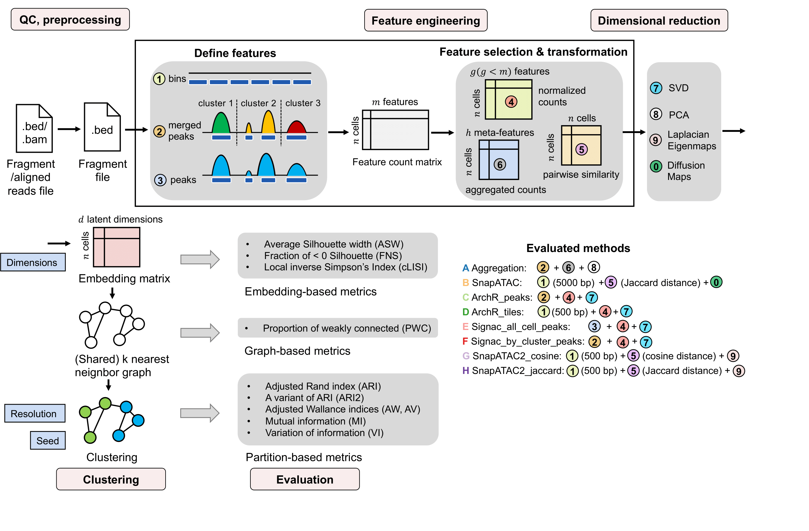

# Snakemake workflow to benchmark computational methods for single-cell chromatin data analysis

This repository contains the snakemake pipeline for our benchmarking study on scATAC-seq data analysis methods. In this study, we benchmark 8 data processing pipelines from 5 recent methods. The evaluation is performed at various stages of the typical data processing workflow, using 10 metrics. This pipeline allows for reproducible and automated analysis of different methods using different datasets.



*** 
- [Setup the environments](#setup-the-environments)
  - [R environment](#r-environment)
  - [Python environment](#python-environment)
- [Run the Pipeline](#running-the-pipeline)
  - [Download the test data](#download-the-test-data)
  - [Prepare Configuration File](#prepare-configuration-file)
  - [Pipeline Commands](#pipeline-commands)
- [Resources](#resources)
  - [Datasets](#datasets)
  - [Result files](#result-files)
  - [Code and files for reproducibility](#code-and-files-for-reproducibility)
- [Publication](#publication)

*** 

## Setup the environments<a name="setup"></a>
We recommend to install all R packages in R instead of using conda. For python environment, we give instructions to use conda.
### R environment<a name="r"></a>
The current code was implemented using R v4.2.3 and Bioconductor v3.16. R>=4.2 and Bioconductor >=3.16 is strongly recommended to avoid error from package `GenomeInfoDb`. All R dependencies (from GitHub, CRAN and Bioconductor) are listed under `envs/install_r_env.R` and may be installed using the command contained there.
### Python environment<a name="conda"></a>
The conda environments are defined in `envs/python_env.yaml` file. The command to install it is:
```commandline
conda env create -f python_env.yaml
```
## Running the Pipeline<a name="running"></a>

### Download the test data<a name="download"></a>
A small test dataset is provided and can be used to test the installation and the pipeline. To download and decompress it:
```commandline
wget https://zenodo.org/record/8212920/files/test_data.tar.gz

tar -xzvf test_data.tar.gz
```
### Prepare Configuration File<a name="config"></a>
The configuration files specify the methods, datasets, parameters, as well as the python and R environments to use. The structure of a config file is as follows:

```yaml
ROOT: outputs # root directory
r_env : base # name of R environment
py_env : snapatac2 # name of Python environment
reticulate_py: NA # the path to the python that will be used by r-reticulate. Used only by Seurat when running Leiden algorithm. If NA, r-reticulate will not be used.

MACS2_PATH: ~/softwares/mambaforge-pypy3/envs/macs2/bin/macs2 # path to MACS2

FEATURE_SELECTION:
  ndim: # number of latent dimensions used
   - 15
   - 30
  cutoff: 0.75 # cutoff of correlation between depth and latent dimensions. dimensions with correlation larger than this value is discarded. 

  
METHODS:
# Possible keys are:
#   R methods: Signac, ArchR, SnapATAC, aggregation
#   python methods: SnapATAC2

 Signac:
   R: true
   feature_type: # for Signac, must be 'all_cell_peaks', or 'by_cluster_peaks', or both.
     - all_cell_peaks
     - by_cluster_peaks
   peak_filtering: true # when performing peak calling, if filter the peaks according to the minimal and maximum widths or not

 ArchR:
   R: true
   feature_type: # for ArchR, must be 'tiles', or 'peaks', or both.
     - tiles
     - peaks
   peak_filtering: false # ArchR already filters peak by only using reproducible peaks
   tile_size: 
     - 500

 SnapATAC1:
   R: true
   feature_type: # for the rest methods, must be "default". Comment out this key will make the pipeline skip running the method
     - default
   peak_filtering: false # instead, use tiles
   tile_size:
      - 5000

 aggregation:
   R: true
   feature_type:
    - default
    # parameters specific to aggregation method
   n_meta_features: 1000 
   n_cells: 22000
   norm_method: tfidf
   reduce: pca
   feature_method: signac_cluster # method for creating the cell-by-feature count matrix. Can use "signac_all", "signac_cluster", "archr_tile", or "archr_peak".


 SnapATAC2:
   R: false
   feature_type:
    - default
   distance: # distance metric used to create the affinity matrix
    - jaccard
    - cosine
   peak_filtering: false
   tile_size:
     - 500

DATA_SCENARIOS:
  Cell_line_mixing: # dataset name. Used as directory name and result file names.
    file: cleaned_data/Cell_line_mixing/GSE162690_CellLine.fragments.filtered.sorted.sorted.tsv.gz # path to the cleaned fragment file
    genome: hg19 # genome name. hg18, hg38 and mm10 are supported. For other genomes, information files need to be created in /database folder, and added in the code of each method, in order to filter blacklist regions.
    seed: # random seed used in Leiden algorithm
     - 0
     - 2
    resolution:  # resolution used in Leiden algorithm
     - 0.1
     - 0.2
    min_width: 20 # minimum width of peaks retained
    max_width: 10000 # maximum width of peaks retained
    iter_resolution: 0.05,0.1,0.2 # for iterativeLSI in ArchR, resolutions used in each iteration, separated by ','
    label_table_file: cleaned_data/Cell_line_mixing/Cell_id_demuxlet_prediction.txt # table file that contains the ground truth label of each cell
    barcode_col: barcode # column name of cell ID
    label_col: prediction # column name of label
  
  Buenrostro_2018: # Edit it
    ...
```

### Pipeline Commands<a name="commands"></a>
To call the pipeline on the test data, use the following command for a dry run to have an overview of the jobs:
```commandline
snakemake --configfile configs/test_data.yaml -n
```
To execute these jobs with 2 cores, call
```commandline
snakemake --configfile configs/test_data.yaml --cores 2
```
## Resources<a name="Resources"></a>
### Datasets<a name="Datasets"></a>
- The data used in the study is deposited [here](https://zenodo.org/record/8212920) on Zenodo.

### Code and files for reproducibility<a name="reproducibility"></a>
- The code and files to reproduce the analysis and visualization in our manuscript is available at the repository: [benchmark_paper](https://github.com/RoseYuan/benchmark_paper/tree/master).

## Publication<a name="publication"></a>
Preprint: https://doi.org/10.1101/2023.08.04.552046
